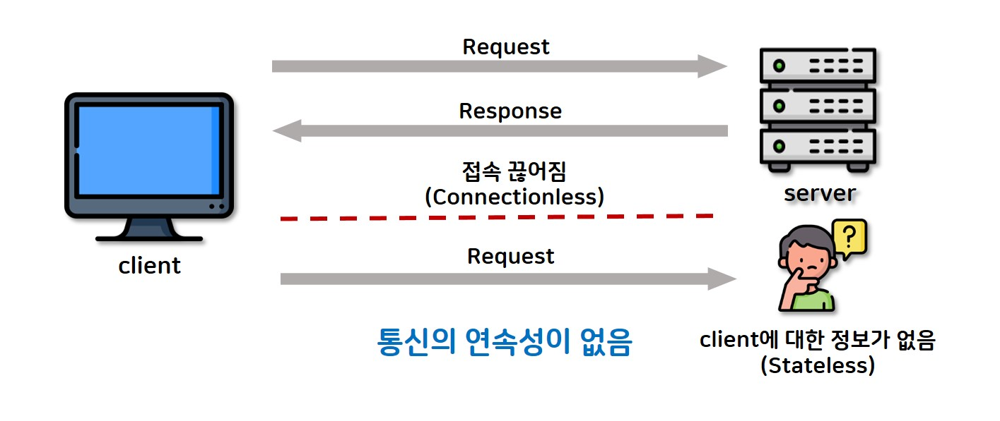

# sessionStudy

## 세션(Session)이란?
- **사용자**와 **서버** 간의 **연결을 유지**하고 사용자 **상태 정보**를 **저장**하기 위한 방법
- 세션은 사용자가 웹 애플리케이션에 접속한 시점부터 종료될 때까지의 기간을 의미
- 클라이언트가 웹 서버에 접속해있는 상태가 하나의 단위 
- **사용자**에 대한 정보를 **서버**가 같고 있기에 `stateful`상태

### 구성 요소
- SessionID
    - **서버**가 사용자에 대해 고유하게 생성한 ID로, **사용자**의 브라우저에 **쿠키** 형태로 **저장**
- Session-Data
    - 사용자 인증 정보, 권한 등 사용자의 상태와 관련된 데이터를 저장
- Session 유지시간
    - 로그아웃(종료)하거나 세션 유지기간이 만료될 때 까지 의미

### 동작 순서
- 1 . Client 요청
- 2 . `Request-Header` 필드의 `Cookie` 에서 **SessionID**를 유/무 확인
- 3 . `SessionID`가 없을 경우, **Server**에서 **생성** 후 **클라이언트**에게 전송
- 4 . `Cookie`에 `SessionID`를 저장
- 5 . 클라이언트 재접속 시, `Cookie`를 이용하여 `SessionID` 값을 서버에 전달