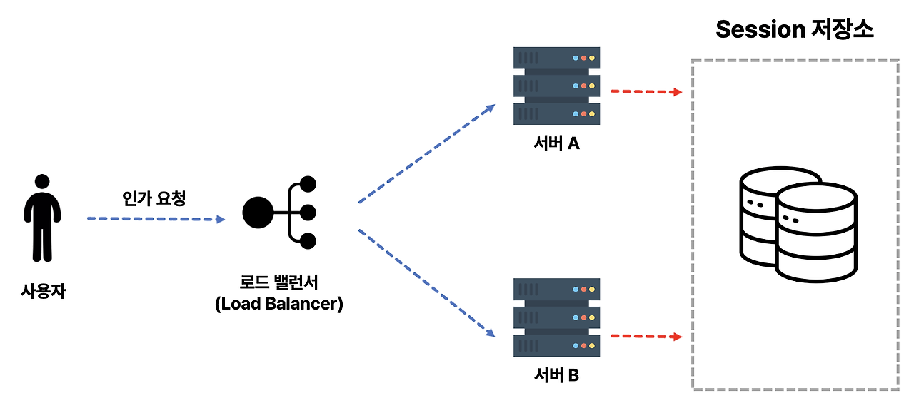

# NextJs(Client) <-> SpringBoots(Servers)   [width Redis Session]

```properties
✅ Redis Session Clustering를 사용해서 병렬적 서버 구조에서도 Session을 공유
```

## 흐름




## Server 설정

- ### Dependencies 추가
```groovy
dependencies {
	implementation 'org.springframework.boot:spring-boot-starter-data-redis'
	implementation 'org.springframework.session:spring-session-data-redis'
}
```

- ### application 설정
  - `namespace`를 사용해서 Redis에 저장될 Session Key 값 지정
  - `store-type` 지정을 통해 Session을 Redis에 저장할 것을 알림
```properties
spring:
  session:
    store-type: redis
    redis:
      # Redis에 저장될 Key Prefix
      namespace: yoo:session

  ############################
  ## Redis Setting
  # docker run -d --name security-redies-db -p 6379:6379 redis --requirepass "123"
  ############################
  data:
    redis:
      host: localhost
      port: 6379
      password: 123
```

- ### Cookie 설정
  - 주의사항
    - Redis Session 사용 시 기본 설정 Session Key값이 `SESSION`으로 변경됨에따라 추가적인 변경 설정이 필요
      - `serializer.setCookieName("JSESSIONID");`
    - 🛑 **삽질**`setSameSite` 설정 주의 `None`으로 설정할 경우 Session ID 값을 Client -> Server 전달 받지 못함
      -  보안을 위해 자체적으로 막음
      - `None`을 사용하고 싶다면 `setUseSecureCookie(true)`를 사용해야 함
```java
@Configuration
public class CookieConfig {
  @Bean
  public CookieSerializer cookieSerializer() {
    DefaultCookieSerializer serializer = new DefaultCookieSerializer();
    /**
     * 😔 보안 문제로 생긴 이슈 [ 삽질 3일.. ]
     *
     *  원인 : Redis 세션과 기본 세션 간의 전송 방식의 차이로 인해 Secure 속성을 설정하지 않은 경우 쿠키가 자동으로 전달이 막힘
     *      - Redis 세션은 기본 세션과는 달리 외부 저장소에서 세션 데이터를 관리함 따라서 안전하지 않은 설정을 통해 쿠키를 
     *      사용 세션 ID의 전송할 경우 브라우저가 이를 차단 --> 서버가 Redis에서 세션을 조회할 수 없게 됨
     *
     * // serializer.setSameSite("None");
     *
     * */
    // HTTP 프로토콜일 경우에도 쿠키 전송 허용 [ 비권장 ]
    serializer.setUseSecureCookie(false);
    // 쿠키가 유효한 도메인을 지정
    serializer.setDomainName("localhost");
    return serializer;
  }
}
```
